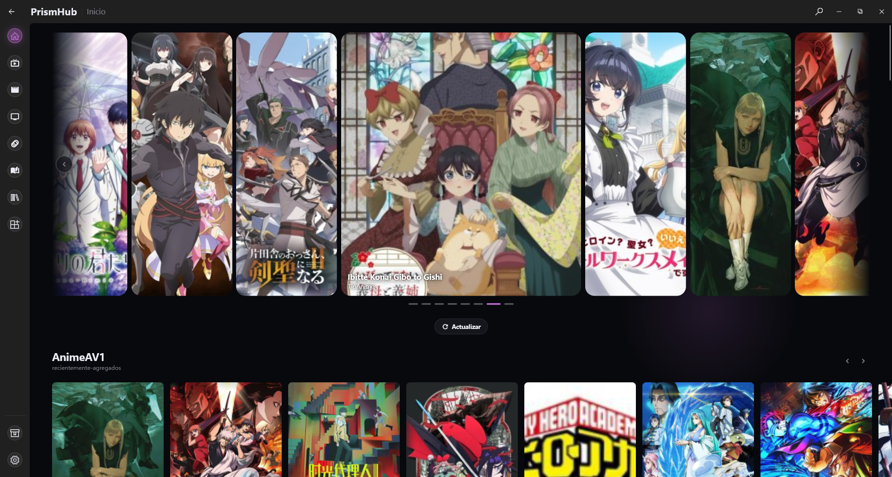
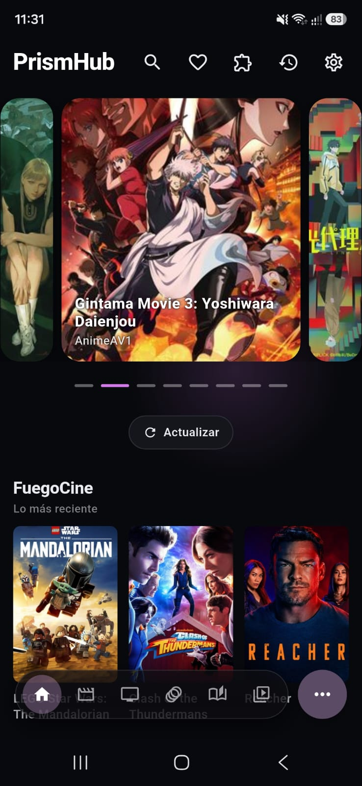
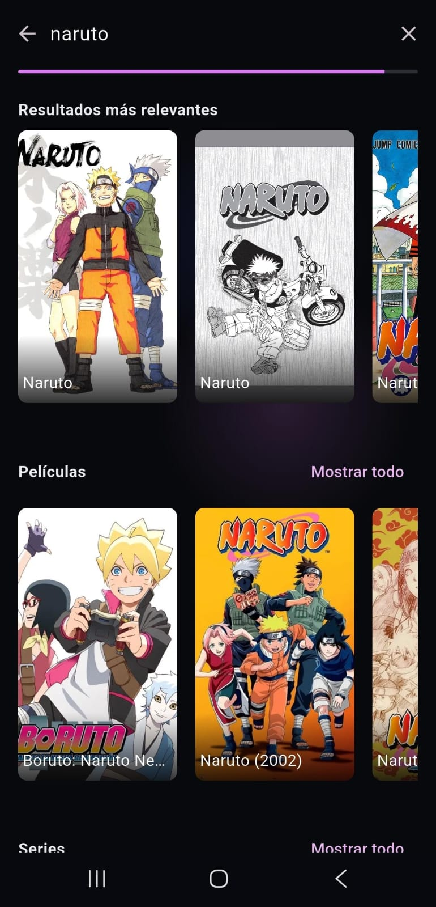

<div align="center">


# PrismHub

**Anime, manga, novelas, series y películas — streaming en vivo, sin límites de catálogo, gratis.**

[](https://github.com/Litdemonick/PrismHub/releases)
[](https://github.com/Litdemonick/PrismHub/releases)
[](https://litdemonick.github.io/PrismHub/license)
[](#instalación)

**[🌐 Sitio oficial](https://litdemonick.github.io/PrismHub/) · [⬇️ Descargar](https://github.com/Litdemonick/PrismHub/releases/latest) · [💬 Discord](https://discord.gg/a9vBhQwqHa)**

</div>

---

## Tabla de contenidos

- [Qué es PrismHub](#qué-es-prismhub)
- [Capturas](#capturas)
- [Por qué existe](#por-qué-existe)
- [Instalación](#instalación)
- [Extensiones](#extensiones)
- [¿Es seguro?](#es-seguro)
- [Reportar un fallo](#reportar-un-fallo)
- [Licencia](#licencia)

---

## Qué es PrismHub

Una aplicación **nativa** — no una página web empaquetada — para ver anime,
series y películas en streaming en vivo, leer manga y novelas, todo desde
un mismo lugar. Corre igual de bien en una PC, un celular o el televisor
de la sala.

- **Streaming en vivo, sin descargas y sin límite de catálogo.** El
  contenido sale de extensiones que hablan con cada sitio en el momento —
  no hay un catálogo fijo que se quede corto ni archivos que ocupen
  espacio.
- **El catálogo crece sin esperar una versión nueva de la app.** Los
  sitios nuevos y los arreglos llegan actualizando el repositorio de
  extensiones, no reinstalando PrismHub.
- **Varios servidores por episodio.** Si uno falla, cambiar al siguiente
  es un toque — la app ya trae la lista completa, no hay que salir a
  buscarla.
- **Lector de manga y novela integrado**, con modo página y modo cascada
  (scroll continuo, tipo webtoon).
- **Tu progreso, en tu aparato.** Sin cuentas, sin servidores propios
  registrando qué mirás: el historial y los favoritos viven donde los
  usás.
- **Pensada también para el televisor.** El mismo instalador de Android
  corre en Android TV, con una interfaz propia para control remoto: filas
  densas, foco siempre visible, sin gestos de dedo.
- **Sin anuncios.** En ningún lado.

## Capturas

<div align="center">

<br /><br />


</div>

## Por qué existe

No depender de un solo sitio. Cada extensión sabe hablar con una fuente
distinta y le devuelve a la app un mismo formato — así que cuando un sitio
cae, cambia de dominio o deja de andar, arreglar la extensión alcanza:
no hace falta esperar una actualización de la app entera, ni perder el
historial o los favoritos que ya tenías.

## Instalación

| Plataforma | Cómo |
|---|---|
| **Windows** | `irm https://raw.githubusercontent.com/Litdemonick/PrismHub/main/install/install.ps1 \| iex` |
| **Linux** | `curl -fsSL https://raw.githubusercontent.com/Litdemonick/PrismHub/main/install/install.sh \| bash` — también hay [PKGBUILD](install/PKGBUILD) para Arch |
| **Android** | Descargá el APK desde [Releases](https://github.com/Litdemonick/PrismHub/releases/latest) |
| **Android TV** | Ver abajo ↓ |

### Instalar en Android TV

En un televisor no hay navegador cómodo para bajar un APK. Usá la app
**[Downloader](https://play.google.com/store/apps/details?id=com.esaba.downloader)**
(gratis, en la tienda de tu TV) y cargá este código cuando te lo pida:

```
9186097
```

Eso te lleva directo al instalador. Sin escribir ninguna dirección larga
con el control remoto. Si preferís hacerlo manual, también funciona por
USB (descargalo en el celular o la PC y abrilo desde el gestor de
archivos del televisor) o por red (SMB/FTP, si el televisor lo soporta).

## Extensiones

Todo el catálogo sale de un solo lugar: **[prism+](https://github.com/Litdemonick/prism-plus)**,
el repositorio oficial, ya configurado de fábrica — no hay que agregar ni
buscar nada por tu cuenta. Es público, bajo licencia MIT, y ahí se puede
leer exactamente qué hace cada extensión antes de instalarla, o proponer
un sitio nuevo.

Dentro de la app, cada extensión tiene su propio interruptor para
activarla o desactivarla sin desinstalarla, y las que traen contenido
+18 piden confirmación explícita antes de mostrarlo.

## ¿Es seguro?

- No instala nada oculto ni junta datos de quien la usa: no hay cuentas
  ni un servidor propio guardando qué mirás.
- No aloja ni distribuye contenido propio: cada extensión lee un sitio
  público de terceros, igual que lo haría un navegador.
- Cada extensión que se publica en prism+ se firma criptográficamente
  antes de llegar a la app — el detalle de cómo está en el
  [README de ese repositorio](https://github.com/Litdemonick/prism-plus#seguridad).
- El instalador no tiene firma digital todavía (ese certificado cuesta
  dinero, y este proyecto no cobra nada) — por eso Windows y Android
  a veces desconfían de él la primera vez. Es un falso positivo conocido,
  no un análisis real del archivo.

## Reportar un fallo

- [Abrir un Issue](https://github.com/Litdemonick/PrismHub/issues)
- Discord — [canal #soporte-prismhub](https://discord.gg/a9vBhQwqHa)
- Correo: badleon2744@gmail.com

## Licencia

**Freeware.** Gratis para descargar y usar. El código fuente de la
aplicación no es público, y esta licencia no otorga derechos sobre él —
texto completo en [litdemonick.github.io/PrismHub/license](https://litdemonick.github.io/PrismHub/license).

Las extensiones de [prism+](https://github.com/Litdemonick/prism-plus) son
un proyecto aparte, bajo licencia MIT: se pueden leer, modificar y
redistribuir libremente.

---

<div align="center">

Hecho por [Litdemonick](https://github.com/Litdemonick) · [LinkedIn](https://www.linkedin.com/in/carlos-miranda-89239339b/)

</div>
